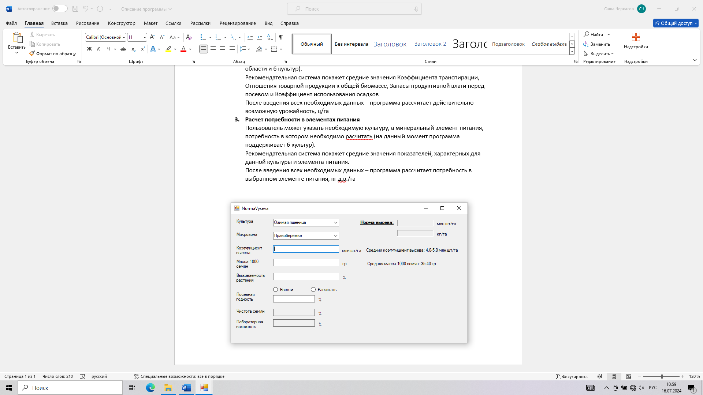
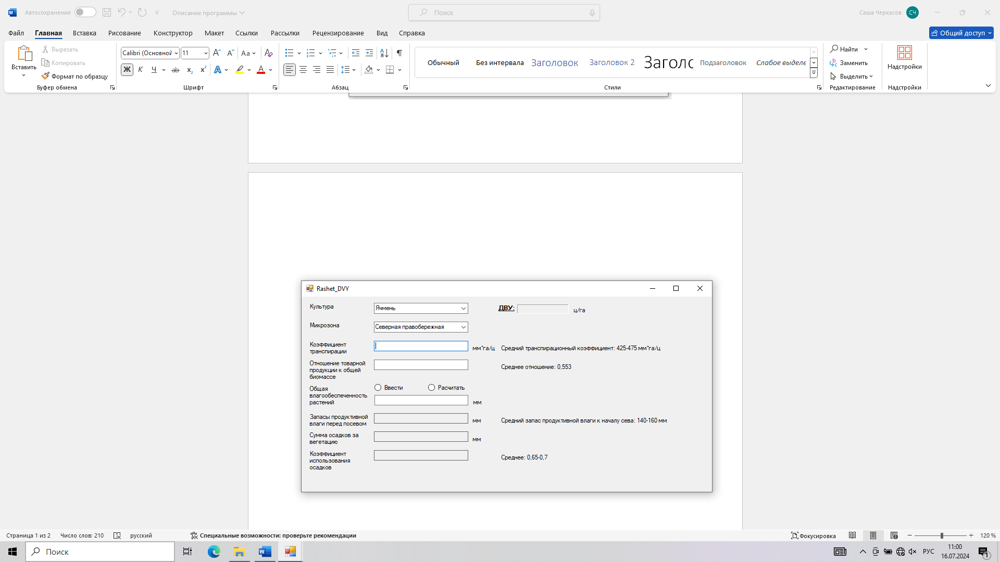
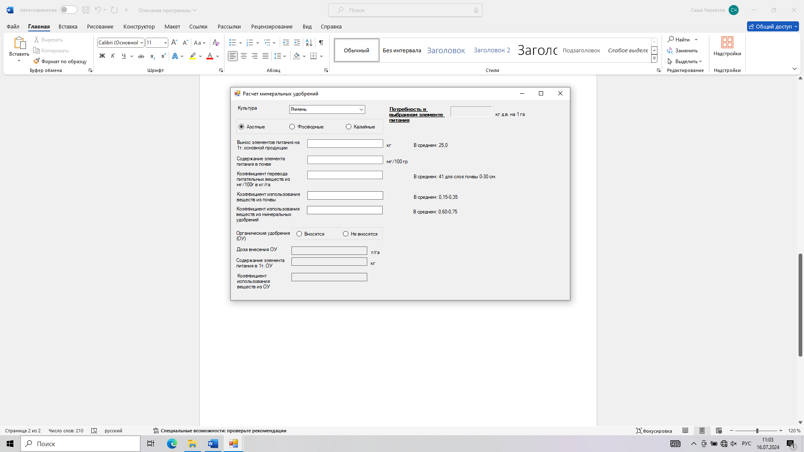

# Smart Agronom
**Smart Agronom**– это простой в использовании калькулятор для расчета 3 агрономических параметров: норма высева, действительно возможная урожайность, доза внесения минеральных удобрений. Программа предназначена для агрономов и собственников фермерских хозяйств занимающихся расчетом и закупкой семенного материала и удобрений.
## Основные функции программы:
1.	Расчет нормы высева
Пользователь может указать необходимую культуру, а также микрозону, где находятся поля (на данный момент программа поддерживает только микрозоны Саратовской области и 6 культур). 
Рекомендательная система покажет средние значения Коэффициента высева и Массы 1000 семян
После введения всех необходимых данных – программа рассчитает норму высева в кг/га и млн.шт./га
2.	Расчет действительно возможной урожайности
Пользователь может указать необходимую культуру, а также микрозону, где находятся поля (на данный момент программа поддерживает только микрозоны Саратовской области и 6 культур). 
Рекомендательная система покажет средние значения Коэффициента транспирации, Отношения товарной продукции к общей биомассе, Запасы продуктивной влаги перед посевом и Коэффициент использования осадков
После введения всех необходимых данных – программа рассчитает действительно возможную урожайность, ц/га
3.	Расчет потребности в элементах питания
Пользователь может указать необходимую культуру, а минеральный элемент питания, потребность в котором необходимо расчитать (на данный момент программа поддерживает 6 культур). 
Рекомендательная система покажет средние значения показателей, характерных для данной культуры и элемента питания.
После введения всех необходимых данных – программа рассчитает потребность в выбранном элементе питания, кг д.в./га
 
 
 
 
 

## Преимущества использования Smart Agronom
Простота: простой и интуитивно понятный интерфейс.
Удобство: рекомендательная система помогает подобрать приближенные к реальности значения без проведения дорогостоящих лабораторных экспертиз показателей почвы.
Гибкость: возможность расчета или прямого введения таких показателей как: Посевная годность, Общая влагообеспеченность, возможность рассчитать минеральные удобрения с учетом и без учета органических удобрений.
## Инструкция по скачианию
1.	Нажмите кнопку Code
2.	В сплывающем меню выберете Dowload ZIP
3.	Разархивируйте архив на рабочем столе
4.	Переходим по пути x64/Debug/SmartAgronom.exe /
  

5.	Запустите файл SmartAgronom.exe
  

6.	Приступайте к работе

## Стек технологий
Среда разработки: Visual Studio
Язык программирования: С++

## Авторы проекта
[Cherkasov-E](https://github.com/Cherkasov-E)

